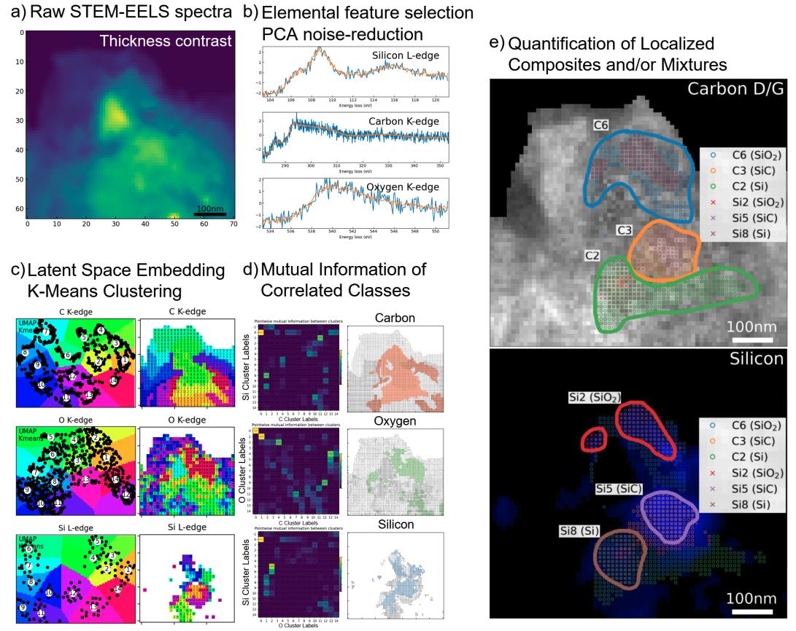

# eelsmapper

**eelsmapper** is a data-driven pipeline for analyzing STEM-EELS spectra to perform high-resolution compositional mapping without relying on reference spectra. It integrates PCA, t-SNE (and/or UMAP), clustering, mutual information, and vector quantization to uncover subtle chemical differences and discover novel material phases.

<!--  -->

---

## Purpose

STEM-EELS data is high-dimensional and noisy, making it challenging to interpret with traditional methods. **eelsmapper** offers a robust, modular pipeline for:

- Denoising spectra (PCA)
- Visualizing compositional patterns (t-SNE and/or UMAP)
- Clustering spectra (K-Means)
- Identifying correlated elemental regions (Mutual Information)
- Enhancing signal quality (Vector Quantization)
- Discovering new material phases without needing reference spectra

---

## Notes:

This package is a python implementation of the following conference papers/talks:

### Data-Driven Analysis of STEM-EELS Spectra for High-Resolution Compositional Mapping

PDF found at https://www.scienceopen.com/hosted-document?doi=10.14293/APMC13-2025-0303

### Unsupervised Machine Learning for Phase Identification and Characterization of High-Resolution STEM EELS in Novel Battery Materials

PDF found at https://openreview.net/forum?id=dw8DFI2esQ

## How to cite:

    Yeo ZY, Lai W, Lee JH, Balakrishnan D, Özyilmaz B, Duane Loh N. Data-driven analysis of STEM-EELS spectra for high-resolution compositional mapping. 13th Asia Pacific Microscopy Congress 2025 (APMC13). 2025; 303. doi:10.14293/apmc13-2025-0303
    

    Yeo ZY, Lai W, Lee JH, Balakrishnan D, Özyilmaz B, Duane Loh N. Unsupervised machine learning for phase identification and characterization of high-resolution STEM EELS in novel battery materials. 2025. Available: https://openreview.net/pdf?id=dw8DFI2esQ
  
